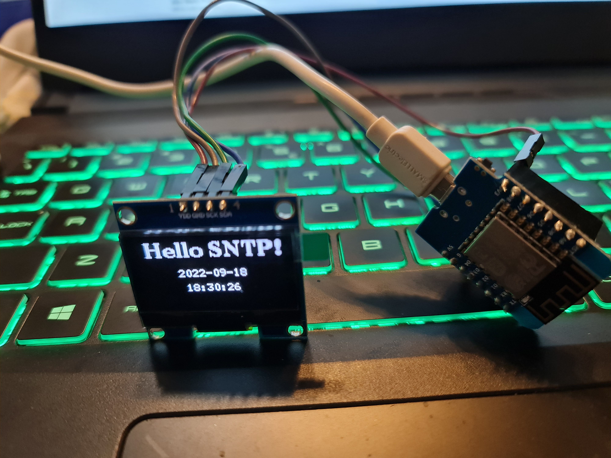

# Andi's modified SNTP example (see below)

## My changes: 
  * Add LCD Support
  * Output date and time on LCD

## ToDo:
  * I2C Support for temperature sensor and pressure sensor
  * OWB Support for DS18B20 temperature probe
  * Merge with MQTT Sample

_________________________________________________________________________________

# Example: using LwIP SNTP module and time functions

This example demonstrates the use of LwIP SNTP module to obtain time from Internet servers. See the README.md file in the upper level 'examples' directory for more information about examples.

## Obtaining time using LwIP SNTP module

ESP8266 connects to WiFi and obtains time using SNTP.
See `initialize_sntp` function for details.

## Working with time

To get current time, [`gettimeofday`](http://man7.org/linux/man-pages/man2/gettimeofday.2.html) function may be used. Additionally the following [standard C library functions](https://en.cppreference.com/w/cpp/header/ctime) can be used to obtain time and manipulate it:

	gettimeofday
	time
	asctime
	clock
	ctime
	difftime
	gmtime
	localtime
	mktime
	strftime

To set time, [`settimeofday`](http://man7.org/linux/man-pages/man2/settimeofday.2.html) POSIX function can be used. It is used internally in LwIP SNTP library to set current time when response from NTP server is received.

## Timezones

To set local timezone, use [`setenv`](http://man7.org/linux/man-pages/man3/setenv.3.html) and [`tzset`](http://man7.org/linux/man-pages/man3/tzset.3.html) POSIX functions. First, call `setenv` to set `TZ` environment variable to the correct value depending on device location. Format of the time string is described in [libc documentation](https://www.gnu.org/software/libc/manual/html_node/TZ-Variable.html). Next, call `tzset` to update C library runtime data for the new time zone. Once these steps are done, `localtime` function will return correct local time, taking time zone offset and daylight saving time into account.
# esp8266_sntp
